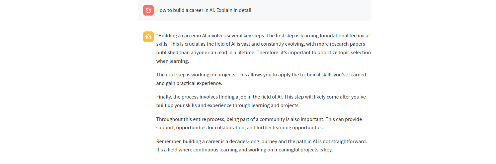
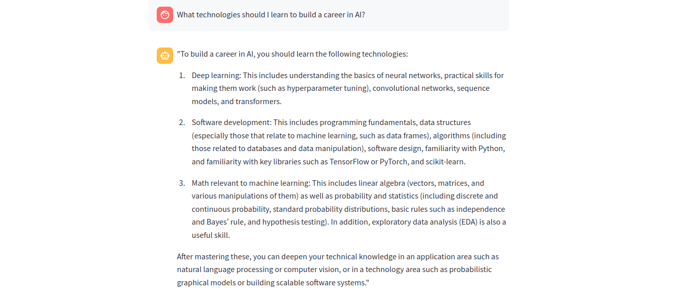

# PDF Q&A RAG Pipeline

A streamlined Retrieval-Augmented Generation (RAG) pipeline for question-answering from PDF documents. This system combines document processing, semantic search, and large language models to provide accurate answers based on PDF content.

## Features

1.  PDF document processing and text extraction for user uploaded pdf documents.
2. Create text chunks and embeddings and store in a vector database. (PostgreSQL)
3. Contex-aware question answering using LLMs.
4. Implemented sentence window retrieval to enhance context quality and reduce hallucination in responses.
5. Responses are strictly limited to information found within the analyzed documents.

**OpenAI gpt-4** serves as the language model for generating responses.

**OpenAI text-embedding-3-small** is used for embedding generation.

**Cohere reranker** optimizes the ranking of retrieved results.

**streamlit** used for intuitive interface.

## Usage demonstration

Let's walk through the system's functionality using two different documents. First, we'll use `eBook_How_to_Build_a_Career_in_AI.pdf` to showcase basic Q&A capabilities:

Here's what happens when we ask about Federated Learning - a topic not covered in our initial document. Since there's no supporting context in the source material, the system properly indicates it cannot provide an answer:

After uploading a new document `LLM_based_Web_App_for_FL.pdf` that contains information about Federated Learning, the system can now provide accurate answers by leveraging the relevant context from this additional source material.

